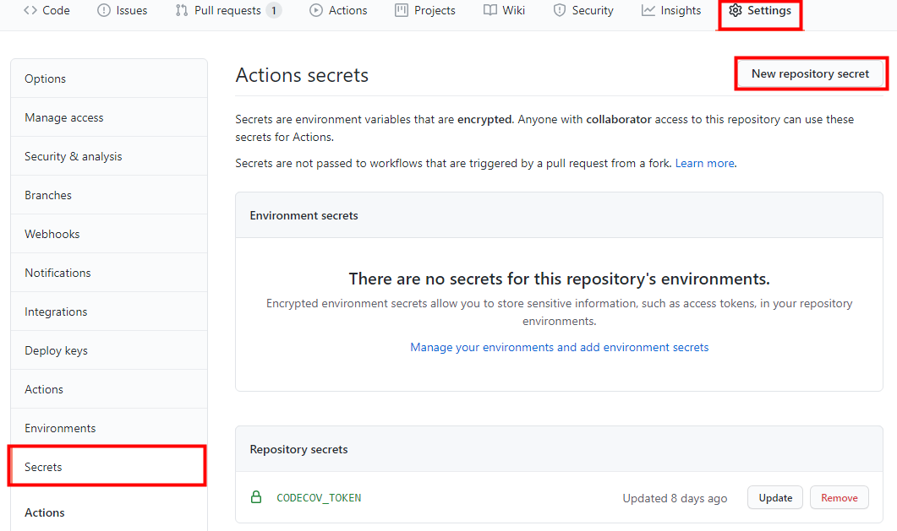

## Code Coverage
Code Coverage 는 테스트를 진행했을때 코드 자체가 얼마나 실행되었는지 측정하는 것이다.
코드는 구문(Statement), 조건(Condition), 결정(Decision) 으로 이루어진다. 이 세가지 항목을 얼마나 커버했느냐에 따라 측정값이 달라진다. 일반적으로 많이 사용되는 커버리지는 구문(Statement)커버리지이며, 실행 코드라인이 한번 이상 실행 되면 충족된다. 조건(Condition)커버리지는 각 내부 조건이 참 혹은 거짓을 가지면 충족된다. 결정(Decision) 커버리지는 각 분기의 내부 조건자체가 아닌 이러한 조건으로 인해 전체 결과가 참 혹은 거짓이면 충족된다. 

## JaCoCo
JaCoCo 는 Java Code Coverage 를 측정하는 오픈소스 라이브러리다. 테스트 결과에 따라 xml, html 형태로 보고서가 작성된다. 또한 목표하는 커버리지를 설정하고, 이를 만족하는지 확인 할 수 있다.

### JaCoCo 설정
*  Gradle 설정에 플러그인 추가 / 설정 진행  
[(상세 설정은 본 포스트 하단 참조.)](#참고)  

```groovy
plugins {
    id 'jacoco'
}

jacoco {
    toolVersion = "0.8.5"
}

jacocoTestReport {
    reports {
        xml.enabled = true // codecov depends on xml format report
        html.enabled = true
    }
}

jacocoTestCoverageVerification {
    violationRules {
        rule {
            element = 'CLASS'
            limit {
                counter = 'METHOD'
                value = 'COVEREDRATIO'
                minimum = 0.90
            }
        }
    }
}
```
* gradle test 수행을 통해 정상 작동 확인  
 ./build/report 경로에 정상적으로 jacoco 리포트가 생성 되었는지 확인한다.
```shell script 
gradle test jacocoTestReport jacocoTestCoverageVerification
```
## Codecov
Codecov 는 Code Coverage 결과를 통합 관리하고, Github / Circle CI / Slack 등과 연동하여 사용할 수 있는 편의를 제공한다. 주로 Github PR 분석, PR Block, Merging Report 의 용도로 사용 한다. 

### Codecov 사용법
* Codecov 가입 진행 [(Codecov 홈페이지)](https://about.codecov.io/)
* Codecov 를 사용할 Github 계정 / Repository 선택하면 Codecov Token 이 발급된다.  
 해당 토큰을 복사 후 Github Repository Secret 에 등록 한다.  

* Github Action 을 이용하여 Gradle test 결과를 Codecov 로 업로드  
프로젝트 root 의 .github/workflows 디렉토리에 test.yml 을 생성한다. 내용은 아래와 같다.  

```yml
name: Test with Gradle

on: # Event
  push:
    branches: [ master ] 
  pull_request:
    branches: [ master ]

jobs: 
  test: # Job id
    runs-on: ubuntu-latest # Runner
    steps:
    - uses: actions/checkout@v2 # Step
    - name: Set up JDK 11 
      uses: actions/setup-java@v1
      with:
        java-version: 11 
    - name: Grant execute permission for gradlew
      run: chmod +x gradlew
    - name: Test with Gradle
      run: ./gradlew test jacocoTestReport jacocoTestCoverageVerification
    - name: Upload coverage to Codecov
      uses: codecov/codecov-action@v1
      with:
        token: ${{ secrets.CODECOV_TOKEN }}
        file: ./build/reports/jacoco/test/jacocoTestReport.xml

```
* Pull Request 요청시 bot 을 통한 자동 Test 결과 comment 생성  
프로젝트 root 에 .codecov.yml 을 생성한다. 내용은 아래와 같다.  

```yml
comment:                  # this is a top-level key
  layout: "reach, diff, flags, files"
  behavior: default
  require_changes: false  # if true: only post the comment if coverage changes
  require_base: no        # [yes :: must have a base report to post]
  require_head: yes       # [yes :: must have a head report to post]
  branches:               # branch names that can post comment
    - "master"
```


## 기타 참고 사항
* Lombok에 의해 자동 생성된 코드에 대한 Test Coverage 예외처리 적용  
프로젝트 root 에 lombok.config 를 생성한다. 내용은 아래와 같다.  

```yml
config.stopBubbling = true
lombok.addLombokGeneratedAnnotation = true
```


## 참고
[JaCoCo-Gradle 공식](https://docs.gradle.org/current/userguide/jacoco_plugin.html)  
[JaCoCo-우아한형제들 블로그](https://woowabros.github.io/experience/2020/02/02/jacoco-config-on-gradle-project.html)  
[CodeCoverage-우아한테크코스](https://woowacourse.github.io/javable/post/2020-10-24-code-coverage/)
